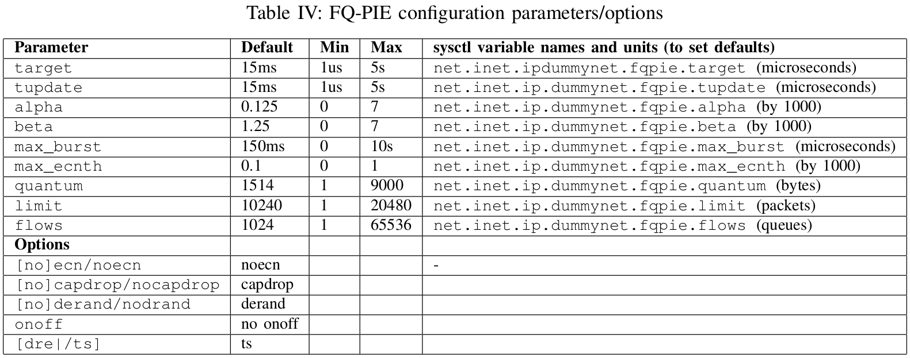

# FQ-PIE-ns-3


### Resources used:
1. RFC 8033, Proportional Integral Controller Enhanced (PIE  https://tools.ietf.org/html/rfc8033

2. IEEE paper on PIE http://ieeexplore.ieee.org/document/6602305/

3. RFC 8290, Fq-Codel https://tools.ietf.org/html/rfc8290

4. Paper related  to FQ-PIE http://caia.swin.edu.au/reports/160418A/CAIA-TR-160418A.pdf

### Design Goals of PIE (As in RFC 8033):

  *  First, queuing latency, instead of queue length, is controlled.
      Queue sizes change with queue draining rates and various flows'
      round-trip times.  Latency bloat is the real issue that needs to
      be addressed, as it impairs real-time applications.  If latency
      can be controlled, bufferbloat is not an issue.  In fact, once
      latency is under control, it frees up buffers for sporadic bursts.

   *  Secondly, PIE aims to attain high link utilization.  The goal of
      low latency shall be achieved without suffering link
      underutilization or losing network efficiency.  An early
      congestion signal could cause TCP to back off and avoid queue
      buildup.  On the other hand, however, TCP's rate reduction could
      result in link underutilization.  There is a delicate balance
      between achieving high link utilization and low latency.

   *  Furthermore, the scheme should be simple to implement and easily
      scalable in both hardware and software.  PIE strives to maintain
      design simplicity similar to that of RED, which has been
      implemented in a wide variety of network devices.

   *  Finally, the scheme should ensure system stability for various
      network topologies and scale well across an arbitrary number of
      streams.  Design parameters shall be set automatically.  Users
      only need to set performance-related parameters such as target
      queue latency, not design parameters.
      
### About the protocol PIE: 

1. FQ-PIE is FlowQueue combined with Proportional Integral controller Enhanced (PIE) algorithm to address the problem of bufferbloat in the network. 

2. Bufferbloat is a phenomenon in which excess buffers in the network cause high latency and latency variation. 

3. PIE,Proportional Integrated controller Enhanced can effectively control the average queuing delay to a target value.

4. PIE, aims to keep the benefits of RED(Random Early Detection) and also include easy implementation and scalability to high speeds(Both are the reasons why RED failed).

5. PIE drops random packets at the onset of congestion (like RED, for congestion control) but congestion detection is based on queuing latency rather than the queuing length as with RED. PIE uses a derivative of queuing latency to help determine congestion levels and an appropriate response. The control parameters of PIE are chosen by control theory but can also be made self tuning based on circumstances.  

6. The structure of PIE  
  
    <pre>
    
        Random Drop
                /               --------------
        -------/  -------------->    | | | | | -------------->
              /|\                   | | | | |
                |               --------------
                |             Queue Buffer   \
                |                     |       \
                |                     |Queue   \
                |                     |Length   \
                |                     |          \
                |                    \|/         \/
                |          -----------------    -------------------
                |          |     Drop      |    |                 |
                -----<-----|  Probability  |<---|   Latency       |
                           |  Calculation  |    |  Calculation    |
                           -----------------    -------------------
    </pre>
  
    When a packet arrives, a random decision is made regarding whether to drop thepacket.  The drop probability is updated periodically based on how far the current latency is away from the target value and whether thequeuing latency is currently trending up or down.  The queuing latency can be obtained using direct measurements or using estimations calculated from the queue length and the dequeue rate.  

7. **Random dropping:** Dropping of an incoming packet is decided based upon a certain _drop probability_ which is obtained from the _drop-probability-calculation-component_ of PIE. The random drop is bypassed if the older queue delay sample is less than half the target latency value when the drop probability is <0.2 or queue has less than a couple of packets.  
    
    In conclusion,on packet arrival,
      
      ```c
      if ( (PIE->qdelay_old_ < QDELAY_REF/2 && PIE->drop_prob_ < 0.2)
          || (queue_.byte_length() <= 2 * MEAN_PKTSIZE) )
              return ENQUE;
      else
        randomly drop the packet with a probability of
        PIE->drop_prob_.
      ```

8. **Drop probability calculation:** The drop probability is periodically updated based on the latency samples collected over a period of time. But when the congestion period ends, we might end up with high drop probabilty values, so PIE algorithm has a mechanism by which the drop probability decays exonentially when congestion doesn't exist. The update interval (T_UPDATE) of the drop-probability is defaulted to 15ms(MAY be reduced in high speed links for smoother response). 

    The control parameters _alpha_ and _beta_(in Hz) are designed using feedback loop analysis. If T_UPDATE is cut in half, alpha must also be cut in half and beta must be increased by 0.25*alpha.   

9. **Latency calculation:** 
  
    * Little's law method: current_qdelay = queue_.byte_length()/dequeue_rate;
  
    * The packets can be time-stamped at enqueue which will be used to calculate latency later.  
   
10. **Burst tolerance:** PIE does not penalize short term packet bursts. Its calculated as follows:  
    ```c
      if PIE->burst_allowance_ > 0
        enqueue packet;
      else
        drop_packet(drop_probability);

      if (PIE->drop_prob_ == 0 and current_qdelay < QDELAY_REF/2 and
          PIE->qdelay_old_ < QDELAY_REF/2)
              PIE->burst_allowance_ = MAX_BURST;
      
      PIE->burst_allowance_ = max(0,PIE->burst_allowance_ - T_UPDATE);
    ```
---

### About FQ-PIE

1. FQ-PIE is the combination of FQ-CoDel's FlowQueue logic with PIE queue management on every dynamically created sub-queue.

2. Goal - Control queuing delays while sharing bottleneck capacity relatively evenly among competing flows.

3. We set each instance of PIE to use timestamps (ts) rather than departure rate estimation (dre) in the context of FQ-PIE.




4. FQ-PIE Parameters
  
    a. **target**: The acceptable persistent queue delay. Drop probability increases as queue delay increases higher than _target_.

    b. **tupdate**: The frequency of drop probability recalculation.

    c. **alpha and beta** are drop probability weights.

    d. **max_burst**: The maximum period of time that PIE does not drop/mark packets.

    e. **max_ecnth**: When ECN is enabled, PIE drops packets instead of marking them when drop probability becomes higher than ECN probability threshold _max\_ecnth_.

    f. **quantum**: number of bytes a queue can be served before being moved to the tail of old queues list.

    g. **limit**: hard size limit of all queues  managed by an instance of the fq_pie scheduler.

    h. **flows**: number of flow queues that fq_pie creates and manages.

5. FQ-PIE Options
    
    a. [no] ecn: enable (**ecn**) or disable (**noecn**) ECN marking for ECN-enabled TCP flows.

    b. [no] capdrop: enable (**capdrop**) or disable (**nocapdrop**) cap drop adjustment.

    c. [no] derand: enable or disable drop probability de-randomisation. De-randomisation eliminates the problem of dropping packets too close or too far.

    d. onoff: enable turning FQ-PIE on and off depending on queue load. PIE turns on when over 1/3 of queue becomes full.

    e. [dre/ts]: calculate queue delay using departure rate estimation (dre) or timestamps (ts).
    
    
---

### About FQ

1. The intention of FQ-CoDel's scheduler is to give each flow its own queue, hence the term 'flow queuing'. Rather than a perfect realization of this, a hashing based scheme is used, where flows are hashed into a number of buckets, each of which has its own queue.

2. The number of buckets is configurable and presently defaults to 1024 in the Linux implementation.

3. By default, the flow hashing is performed on the 5-tuple of source and destination IP addresses, source and destination port numbers, and protocol number.

4. FQ-CoDel's DRR scheduler is byte-based, employing a DRR mechanism between queues. This works by keeping a track of the current number of "byte-credits" of each queue. This number is initialized to the configurable quantum; each time a queue gets dequeue opportunity, it gets to dequeue packets, thus decreasing the number of credits by the packet size for each packet. This continues until the value of the byte credits counter becomes zero or less, at which point the counter is increased by one quantum, and the dequeue opportunity ends.


---


